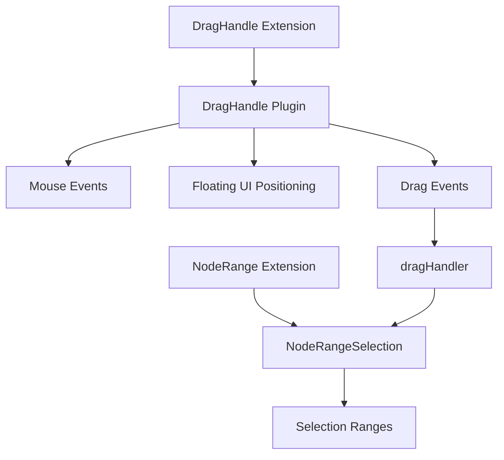

# TipTap 官方拖拽实现架构分析

## 一、整体架构

官方的拖拽系统由三个核心包组成：

```
extension-drag-handle         # 核心拖拽逻辑
extension-drag-handle-react   # React 组件封装
extension-node-range          # 节点选择机制
```

### 架构设计原则



## 二、核心组件详解

### 1. DragHandle Extension（主入口）

```typescript
// extension-drag-handle/src/drag-handle.ts

export const DragHandle = Extension.create<DragHandleOptions>({
  name: 'dragHandle',

  // 配置项
  addOptions() {
    return {
      render() { /* 渲染句柄元素 */ },
      computePositionConfig: {}, // floating-ui 配置
      locked: false,              // 锁定状态
      onNodeChange: () => {},     // 节点变化回调
    }
  },

  // 添加命令
  addCommands() {
    return {
      lockDragHandle: () => {},   // 锁定句柄
      unlockDragHandle: () => {}, // 解锁句柄
      toggleDragHandle: () => {}, // 切换锁定状态
    }
  },

  // 注册插件
  addProseMirrorPlugins() {
    const element = this.options.render()
    return [
      DragHandlePlugin({
        element,
        editor: this.editor,
        // ...
      }).plugin
    ]
  }
})
```

**设计要点**：
- 使用 Extension 模式，符合 TipTap 的扩展体系
- 分离渲染逻辑（render）和定位逻辑（computePositionConfig）
- 提供锁定机制，防止拖拽时句柄消失

### 2. DragHandle Plugin（核心逻辑）

```typescript
// extension-drag-handle/src/drag-handle-plugin.ts

export const DragHandlePlugin = (props) => {
  // 状态管理
  let locked = false
  let currentNode: Node | null = null
  let currentNodePos = -1

  // 性能优化：使用 RAF 限制更新频率
  let rafId: number | null = null
  let pendingMouseCoords: { x: number; y: number } | null = null

  return {
    plugin: new Plugin({
      // 插件状态管理
      state: {
        init() { return { locked: false } },
        apply(tr, value) {
          // 处理文档变化时的位置映射
          if (tr.docChanged && currentNodePos !== -1) {
            // 使用 ProseMirror 的 mapping 更新位置
            const newPos = tr.mapping.map(currentNodePos)
            currentNodePos = newPos
          }
          // 处理协作编辑（Yjs）
          if (isChangeOrigin(tr)) {
            // 使用相对位置映射
            const newPos = getAbsolutePos(state, currentNodeRelPos)
            currentNodePos = newPos
          }
        }
      },

      // 视图层生命周期
      view: (view) => ({
        update(_, oldState) {
          // 文档变化时重新定位句柄
          if (view.state.doc.eq(oldState.doc)) return

          // 获取新位置的 DOM 节点
          let domNode = view.nodeDOM(currentNodePos)
          repositionDragHandle(domNode)
        },
        destroy() {
          // 清理
        }
      }),

      // DOM 事件处理
      props: {
        handleDOMEvents: {
          mousemove(view, e) {
            // 使用 RAF 优化性能
            pendingMouseCoords = { x: e.clientX, y: e.clientY }

            if (rafId) return false

            rafId = requestAnimationFrame(() => {
              // 查找鼠标旁边的节点
              const nodeData = findElementNextToCoords({
                x, y, direction: 'right', editor
              })

              // 更新句柄位置
              repositionDragHandle(domNode)
              showHandle()
            })
          }
        }
      }
    })
  }
}
```

**关键设计决策**：

1. **性能优化**：
   - 使用 `requestAnimationFrame` 限制 mousemove 更新频率
   - 缓存鼠标坐标，避免频繁计算

2. **位置追踪**：
   - 存储 `currentNodePos` 追踪当前节点位置
   - 文档变化时使用 `tr.mapping.map()` 更新位置

3. **协作编辑支持**：
   - 支持 Yjs 协作，使用相对位置（relativePosition）
   - 检测远程更改（isChangeOrigin）

### 3. 拖拽处理机制（dragHandler）

```typescript
// helpers/dragHandler.ts

export function dragHandler(event: DragEvent, editor: Editor) {
  const { view } = editor

  // 获取拖拽范围
  const dragHandleRanges = getDragHandleRanges(event, editor)

  // 创建节点范围选择
  const selection = NodeRangeSelection.create(
    view.state.doc, from, to
  )

  // 克隆拖拽的元素作为拖拽图像
  ranges.forEach(range => {
    const element = view.nodeDOM(range.$from.pos)
    const clonedElement = cloneElement(element)
    wrapper.append(clonedElement)
  })

  // 设置拖拽图像
  event.dataTransfer.setDragImage(wrapper, 0, 0)

  // 告诉 ProseMirror 拖拽内容
  view.dragging = { slice, move: true }

  // 设置选择
  tr.setSelection(selection)
  view.dispatch(tr)
}
```

**核心流程**：
1. 检测拖拽起始位置的节点
2. 创建节点范围选择（NodeRangeSelection）
3. 克隆节点作为拖拽图像
4. 设置 ProseMirror 的 dragging 状态

### 4. NodeRange Extension（选择机制）

```typescript
// extension-node-range/src/node-range.ts

export const NodeRange = Extension.create({
  name: 'nodeRange',

  // 键盘快捷键
  addKeyboardShortcuts() {
    return {
      'Shift-ArrowUp': ({ editor }) => {
        // 向上扩展选择
        const nodeRangeSelection = NodeRangeSelection.create(
          doc, anchor, head, depth, -1
        )
      },
      'Mod-a': ({ editor }) => {
        // 全选所有节点
      }
    }
  },

  // 插件
  addProseMirrorPlugins() {
    return [
      new Plugin({
        props: {
          handleClick(view, pos, event) {
            // 处理点击选择
            if (this.options.key && !event[keyMap[this.options.key]]) {
              return false
            }

            // 创建节点选择
            const nodeRangeSelection = NodeRangeSelection.create(
              doc, anchor, head, depth
            )
          }
        }
      })
    ]
  }
})
```

**NodeRangeSelection 类**：
```typescript
class NodeRangeSelection extends Selection {
  // 创建节点范围选择
  static create(doc, from, to, depth) {
    const ranges = getSelectionRanges($from, $to, depth)
    return new NodeRangeSelection(ranges)
  }

  // 获取选中的内容
  content() {
    return this.doc.slice(this.from, this.to)
  }

  // 扩展选择
  extendForwards() { /* ... */ }
  extendBackwards() { /* ... */ }
}
```

## 三、关键技术点

### 1. 位置计算与定位

使用 `@floating-ui/dom` 库进行精确定位：

```typescript
function repositionDragHandle(dom: Element) {
  const virtualElement = {
    getBoundingClientRect: () => dom.getBoundingClientRect()
  }

  computePosition(virtualElement, element, {
    placement: 'left-start',
    strategy: 'absolute',
    middleware: [offset(8), flip(), shift()]
  }).then(val => {
    element.style.left = `${val.x}px`
    element.style.top = `${val.y}px`
  })
}
```

### 2. 节点查找算法

```typescript
function findElementNextToCoords({ x, y, direction, editor }) {
  // 获取坐标处的元素
  const elementAtCoords = document.elementFromPoint(x, y)

  // 向右查找最近的节点
  if (direction === 'right') {
    // 查找算法...
  }

  return {
    resultElement,
    resultNode,
    pos
  }
}
```

### 3. 协作编辑支持

```typescript
// 相对位置转换（Yjs 支持）
const getRelativePos = (state, absolutePos) => {
  const ystate = ySyncPluginKey.getState(state)
  return absolutePositionToRelativePosition(
    absolutePos, ystate.type, ystate.binding.mapping
  )
}

const getAbsolutePos = (state, relativePos) => {
  const ystate = ySyncPluginKey.getState(state)
  return relativePositionToAbsolutePosition(
    ystate.doc, ystate.type, relativePos, ystate.binding.mapping
  )
}
```

## 四、React 组件封装

```typescript
export const DragHandle = (props: DragHandleProps) => {
  const [element, setElement] = useState<HTMLDivElement | null>(null)
  const plugin = useRef<Plugin | null>(null)

  useEffect(() => {
    if (!element || editor.isDestroyed) return

    // 创建插件
    const initPlugin = DragHandlePlugin({
      editor, element, /* ... */
    })

    // 注册到编辑器
    editor.registerPlugin(initPlugin.plugin)

    return () => {
      // 清理
      editor.unregisterPlugin(pluginKey)
    }
  }, [element, editor])

  return (
    <div ref={setElement} className={className}>
      {children}
    </div>
  )
}
```

## 五、设计亮点

1. **解耦设计**：
   - 拖拽 UI（DragHandle）与选择逻辑（NodeRange）分离
   - 渲染与定位逻辑分离

2. **性能优化**：
   - RAF 限流
   - 坐标缓存
   - 按需更新

3. **协作支持**：
   - Yjs 集成
   - 相对/绝对位置转换

4. **扩展性**：
   - 插件化架构
   - 事件回调机制
   - 可自定义渲染

## 六、与你的需求对比

| 功能 | 官方实现 | 你的需求 |
|------|---------|---------|
| 基础拖拽 | ✅ 支持 | ✅ 需要 |
| 节点选择 | ✅ NodeRangeSelection | ✅ 需要 |
| 边缘检测 | ❌ 无 | ✅ 创建列布局 |
| 列数限制 | ❌ 无 | ✅ 最多5列 |
| 拖放逻辑 | ⚠️ 基础 | ✅ 复杂逻辑 |
| 视觉反馈 | ⚠️ 基础 | ✅ 蓝线提示 |

## 七、建议的改造方案

基于官方代码，你可以：

1. **保留核心架构**：
   - Plugin 模式
   - 位置追踪机制
   - RAF 性能优化

2. **扩展功能**：
   - 添加边缘检测逻辑
   - 实现列布局创建
   - 增强视觉反馈

3. **简化不需要的**：
   - 移除 Yjs 协作支持（如果不需要）
   - 简化 NodeRange（如果用不到复杂选择）

4. **重写关键部分**：
   - `dragHandler` - 添加列创建逻辑
   - `findElementNextToCoords` - 增强边缘检测
   - `handleDOMEvents` - 添加自定义拖放处理